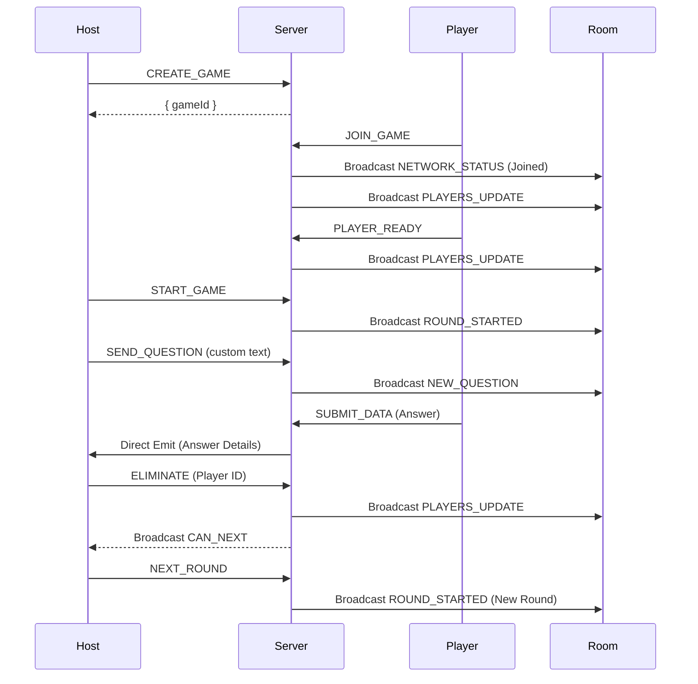

# Internet Bachelor: Socket API Documentation & Workflow

This document provides a detailed overview of the standardized socket communication system implemented for the Internet Bachelor game.

## 1. Unified Communication Structure
All game-specific communication follows a standardized format to ensure consistency and ease of integration for the frontend.

### A. Client Request (Emit)
When the client (Host or Player) sends an event to the server, it uses the following structure via `GAME_EVENT`:
```json
{
  "gameId": "string",
  "type": "EVENT_TYPE",
  "payload": { ... }
}
```

### B. Server Response (ACK)
The server responds to every emit with a standard Acknowledgment:
```json
{
  "success": true,
  "data": { ... },
  "message": "Optional message"
}
```

### C. Server Broadcast (GAME_EVENT)
When the server updates the game state for the room, it broadcasts:
```json
{
  "type": "EVENT_TYPE",
  "payload": { ... }
}
```

---

## 2. Core Connection Events
These events manage the user's presence in the game.

### `CREATE_GAME` (Host)
*   **Purpose**: Initialize a new game session.
*   **Payload**: `{ gameType: "INTERNET_BACHELOR", userId: "string" }`
*   **Result**: Returns `{ gameId: "uuid" }`.

### `JOIN_GAME` (Player)
*   **Purpose**: Join an existing game.
*   **Payload**: `{ gameId: "string", userId: "string" }`
*   **Smart Logic**: Automatically removes user from any other active game.
*   **Broadcasts**: `NETWORK_STATUS` and `PLAYERS_UPDATE`.

### `RECONNECT_GAME` (Any)
*   **Purpose**: Sync state after a disconnection or page refresh.
*   **Payload**: `{ gameId: "string", userId: "string" }`
*   **Result**: Returns full `session` state, including `currentRound` and `roundState`.

---

## 3. Game Flow Events (In-Game)

### `PLAYER_READY` (Player)
*   **Trigger**: Player clicks "Ready" in the lobby.
*   **Broadcast**: `PLAYERS_UPDATE`.

### `START_GAME` (Host)
*   **Trigger**: Host starts the game after all players are ready.
*   **Broadcast**: `ROUND_STARTED` with round configuration.

### `SEND_QUESTION` (Host)
*   **Trigger**: Host types and sends a custom question.
*   **Broadcast**: `NEW_QUESTION` to all players.

### `TYPING` (Any)
*   **Purpose**: Visual indicator that someone is typing.
*   **Broadcast**: `USER_TYPING` with `{ userId, isTyping }`.

### `SUBMIT_DATA` (Player)
*   **Purpose**: Submit an answer, image, or video.
*   **Broadcast**: `ANSWER_SUBMITTED` (or similar) to the **Host only**.

### `ELIMINATE` (Host)
*   **Purpose**: Host selects one or more players to eliminate.
*   **Logic**: If targets are met, server triggers `CAN_NEXT`.
*   **Broadcasts**: `PLAYERS_UPDATE` and potentially `CAN_NEXT` (Host only).

### `NEXT_ROUND` (Host)
*   **Purpose**: Advance the game to the next defined round.
*   **Trigger**: Only after `CAN_NEXT` is received by the host.

---

## 4. Key Server Broadcasts (Listeners)

| Event Type | Recipient | Payload Description |
| :--- | :--- | :--- |
| `NETWORK_STATUS` | Room | `{ userId, isConnected, isHost, message }` |
| `PLAYERS_UPDATE` | Room | Updated array of all player objects. |
| `ROUND_STARTED` | Room | Info about the current round (type, rules). |
| `NEW_QUESTION` | Room | The question text from the host. |
| `CAN_NEXT` | **Host** | `{ nextRoundIndex }` - Notification that the host can advance. |
| `GAME_ENDED` | Room | `{ winner: Player }` - The final result. |

---

## 5. End-to-End Workflow



## 6. Smart Features Summary
*   **Generalized Logic**: No hard-coded round names; system uses `nextAtCount` to trigger transitions.
*   **User Tracking**: Users are mapped to `user_game:userId` in Redis to prevent multi-game presence.
*   **Audit Trail**: Every significant event is persisted to MongoDB via `saveGameEvent` for history and analytics.
